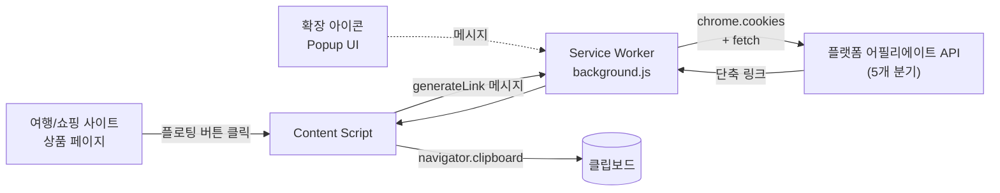

# affiliate-link-generator — 어필리에이트 링크 자동 생성 크롬 확장

크롬 웹스토어 등록 명: **제휴링크 톡**

여행·쇼핑 사이트의 상품 페이지에서 한 번의 클릭으로 어필리에이트 링크를 생성하고 클립보드에 자동 복사하는 크롬 확장 프로그램입니다.

**URL**: [https://buly.kr/6141yax](https://buly.kr/6141yax)

---

## 만든 이유

packageTalk에서 어필리에이트 링크를 등록할 때 다음 과정을 매번 수동으로 반복해야 했습니다.

1. 플랫폼별 어필리에이트 사이트에 접속
2. 본 사이트에서 상품 URL 복사
3. 어필리에이트 도구에 붙여넣어 변환 링크 생성

이 반복 작업을 단축하기 위해 크롬 확장으로 자동화했습니다.

## 지원 플랫폼

마이리얼트립 / 와그 / 클룩 / 트립닷컴 / 쿠팡 (총 5개)

## 기술 스택

- **Language**: JavaScript (vanilla, 빌드 도구 없음)
- **Platform**: Chrome Extension Manifest V3
- **Chrome APIs**: `chrome.cookies`, `chrome.tabs`, `chrome.runtime`
- **Permissions**: `activeTab`, `cookies`, `clipboardWrite`

## 아키텍처

| 모듈 | 역할 |
|---|---|
| `background/background.js` | Service Worker. 쿠키 조회·플랫폼 API 호출·응답 파싱 등 실제 링크 생성 담당 |
| `content/content.js` | 상품 페이지에 플로팅 "링크 생성" 버튼 주입, SPA 네비게이션 추적, 쿠팡 상품 데이터 추출 |
| `popup/` | 확장 아이콘 클릭 시 UI (사이트 선택이 필요한 플랫폼용) |
| `utils/platforms.js` | 5개 플랫폼별 설정을 단일 객체로 추상화 (`urlPattern`, `apiUrl`, `buildHeaders`, `buildBody`, `parseResponse`) |

## 핵심 기능

- **상품 페이지 진입 시 플로팅 버튼 자동 노출** — `pagePattern` 정규식 기반으로 페이지 매칭, 클릭 한 번으로 링크 생성 + 클립보드 복사
- **5개 플랫폼 분기 지원** — 인증 방식·요청 형식·응답 구조가 모두 달라 플랫폼별 설정 객체로 추상화
- **세션 만료 자동 처리** — 401/403 응답 감지 시 사용자에게 안내 후 해당 플랫폼 로그인 페이지를 새 탭으로 자동 오픈

## 개발 노트

- **플랫폼별 인증 방식 추상화**
  단일 토큰 쿠키, 다중 쿠키 조합, HTML 안에 박힌 config 등 인증 방식이 모두 달라 `PLATFORMS` 객체에 `buildHeaders` / `buildBody` / `parseResponse` 함수를 플랫폼별로 정의해 분기 로직을 단일 dispatch로 처리

  | 플랫폼 | 인증 방식 |
  |---|---|
  | 마이리얼트립 | 쿠키 `partner-legacy-access-token` |
  | 와그 | 쿠키 `wt` (Bearer 토큰으로 전송) |
  | 클룩 | 쿠키 3종 조합(`sess` + `CSRF-TOKEN` + `kepler_id`) + 커스텀 헤더 |
  | 트립닷컴 | 파트너 페이지 HTML을 fetch 후 `window.__CONFIG__` 정규식 파싱하여 `uid`/`aid` 추출 |
  | 쿠팡 | 쿠키 `sid` |

- **사이트 선택 분기 (클룩 · 트립닷컴)**
  두 플랫폼은 사용자 계정에 등록된 사이트 목록 중 하나를 선택해야 링크가 발급됨. `requiresSiteSelection` 플래그로 popup UI 흐름을 분리

- **쿠팡 상품 데이터 추출**
  쿠팡은 URL만으론 링크 생성이 안 되고 상품 ID·아이템 ID·가격·이미지 등 메타데이터가 필요. content script가 페이지의 `self.__next_f.push([...])` 스트리밍 데이터에서 `atfData` JSON 블록을 중괄호 depth 카운팅으로 추출, 실패 시 정규식 폴백

- **SPA 네비게이션 대응 (이중 안전장치)**
  - background에서 `chrome.tabs.onUpdated` → content로 `urlChanged` 메시지
  - content에서 1초 단위 폴링 + 버튼 DOM 삭제 감지로 자동 복구
  단일 메커니즘만으론 일부 플랫폼의 SPA 라우팅을 놓치는 케이스가 있어 두 가지를 병행

- **클립보드 복사 폴백**
  HTTPS 환경에서도 일부 페이지에서 `navigator.clipboard.writeText`가 실패하는 케이스가 있어 textarea + `document.execCommand("copy")` 폴백 구현

## 회고

- 본인 작업 자동화 목적이었으나 외부 사용자가 일정 수준 발생 (블로그 어필리에이트 활동을 하는 사용자로 추정)
