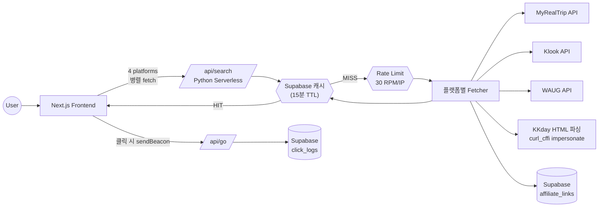
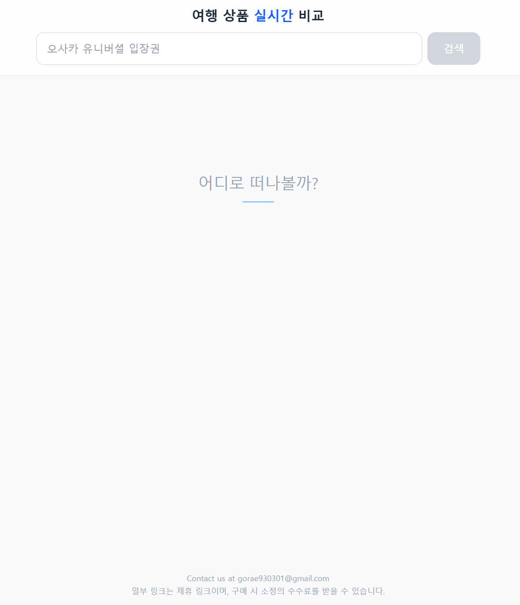
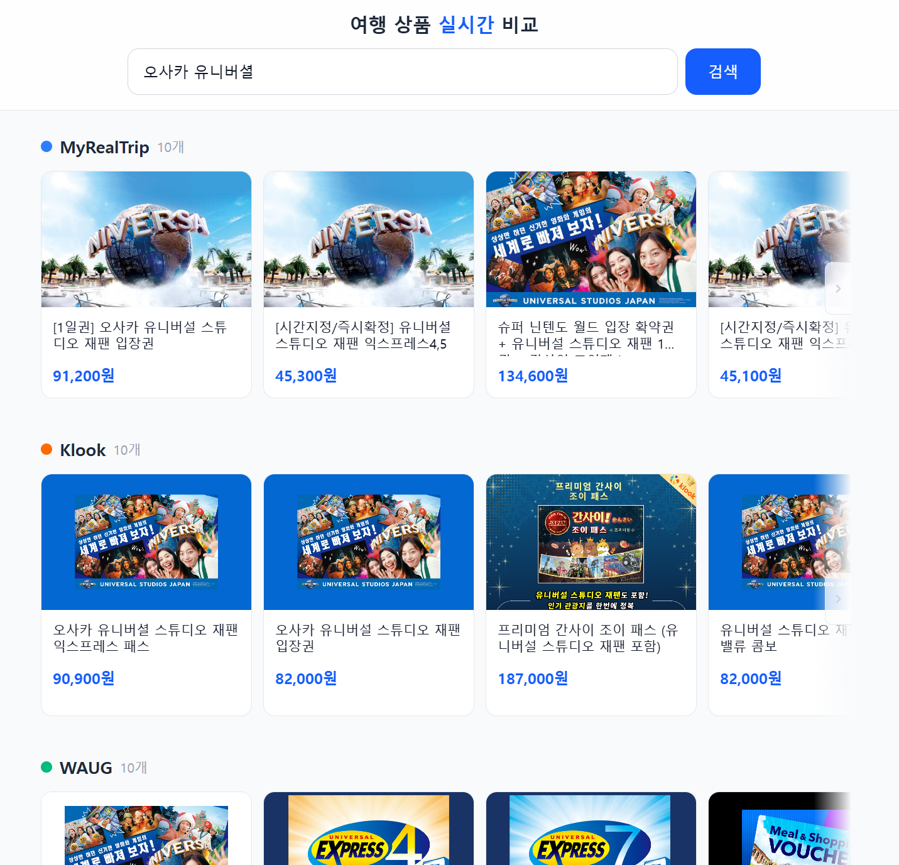

# packageTalk — 여행 액티비티 플랫폼 비교 웹 서비스

MyRealTrip / Klook / WAUG / KKday 4개 플랫폼의 여행 액티비티 상품을 한 검색어로 동시에 조회·비교할 수 있는 사이드 프로젝트입니다.

**URL**: [https://www.packagetalk.com/](https://www.packagetalk.com/)

---

## 만든 이유

여행 액티비티 입장권을 살 때마다 플랫폼별 가격이 달라 매번 여러 탭을 열어 비교하는 게 번거로웠습니다.

한 화면에서 비교가 가능하면 본인도 편하고, 어필리에이트를 통한 수익 창출도 가능하다고 판단해 직접 만들었습니다.

## 기술 스택

- **Frontend** : Next.js 16, React 19, TypeScript, Tailwind CSS 4
- **Backend** : Python (Vercel Serverless Functions, BaseHTTPRequestHandler)
- **HTTP Client** : curl_cffi (KKday 봇 탐지 우회용 `impersonate="chrome"`)
- **Database** : Supabase (PostgreSQL)
  - rate limit, search_cache, click_logs, affiliate_links
- **Hosting** : Vercel
- **Analytics** : Vercel Analytics

## 아키텍처

| 레이어 | 구성 |
|---|---|
| Frontend | 검색어 입력 시 4개 플랫폼으로 동시 fetch, `Promise.allSettled`로 빠른 응답부터 점진 렌더링 (15초 timeout) |
| API | `/api/search?q=&platform=` 단일 엔드포인트, 플랫폼별 fetcher를 dispatch |
| 캐시 | Supabase `search_cache` 테이블에 (platform, query) 단위로 15분간 결과 보관 |
| Rate Limit | Supabase RPC `increment_rate_limit` 으로 IP당 분당 30회 제한 |
| 어필리에이트 | 검색 결과의 URL을 `affiliate_links` 테이블과 매칭하여 변환 링크 부착 |
| 클릭 추적 | `/api/go` 가 sendBeacon 으로 호출되어 `click_logs` 적재 (서버에서 affiliate_pk 재조회로 무결성 확보) |

## 핵심 기술 결정

- **4개 플랫폼 병렬 fetch + 점진 렌더링**
  서버에서 4개를 묶어 처리하지 않고 클라이언트에서 4번 fetch한 뒤 `Promise.allSettled` 로 도착하는 순서대로 화면에 반영. 한 플랫폼이 느려도 나머지는 즉시 보여줄 수 있음

- **Supabase 기반 15분 TTL 캐시 (cache-aside)**
  외부 플랫폼 API에 매 검색마다 호출하지 않도록 (platform, query) 키 단위로 캐시. 캐시 hit 시 rate limit 소모 없이 즉시 응답

- **IP 기반 rate limiting (분당 30회)**
  Supabase RPC 한 번으로 increment + check를 원자적으로 처리. 비용 폭주와 외부 플랫폼 차단 위험을 동시에 방어

- **KKday는 HTML 파싱 + 봇 탐지 우회**
  KKday만 검색 API가 외부에 노출되지 않아 HTML에서 `"products":[...]` JSON 배열을 depth 카운팅으로 추출. `curl_cffi` 의 `impersonate="chrome"` 으로 TLS fingerprint까지 흉내내 봇 탐지 우회

- **플랫폼별 응답을 단일 schema로 정규화**
  4개 플랫폼이 각기 다른 필드 구조를 갖지만 프론트는 `{name, price, original_price, currency, url, image_url, id}` 단일 형태만 다룸

- **클릭 추적 시 클라이언트 값 미신뢰**
  `/api/go` 가 클라이언트가 보낸 `affiliate_pk` 를 그대로 저장하지 않고, 서버에서 platform/url 로 다시 조회해서 매핑. 위변조된 값으로 통계가 오염되는 것을 차단

## 화면

| 검색 전 | 검색 결과 |
|---|---|
|  |  |

## 회고

- 실사용자가 있고 규모는 작지만 수익이 발생하는 단계까지 운영 중
- 모든 상품의 어필리에이트 링크를 사전 등록하는 건 비현실적이라, 누적되는 **검색어·클릭 로그를 기반으로 주 1회 미생성 링크만 필터링해 보완하는 방식**으로 운영 정착
- 누적된 검색어/클릭 데이터는 추후 가공 시 외부에 판매 가능한 자산으로 발전할 여지가 있다고 보고 있음
